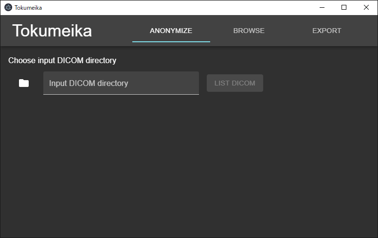
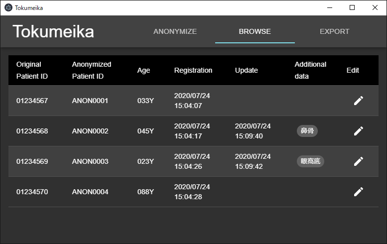
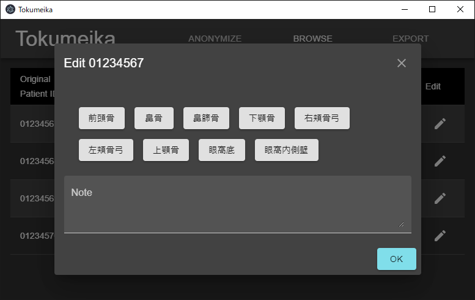

# Tokumeika

DICOM de-identification and management tool.

<table>
  <thead><tr>
    <td>Anonymize</td><td>Browse</td>
  </tr></thead>
  <tbody><tr>
    <td></td><td></td>
  </tr></tbody>
  <thead><tr>
    <td>Dialog</td><td>Export</td>
    </td>
  </tr></thead>
  <tbody><tr>
    <td></td><td></td>
  </tr></tbody>
</table>

## Flowchart
[Original DICOM] --(De-identification)-> [Anonymous DICOM + private data] --(Export)-> [Anonymous DICOM + anonymous data]

## Install
Download latest version from the [releases](https://github.com/yk-szk/Tokumeika/releases) page.

## TODOs
- Implement progress indication
- Write more tests

## Development
See [this](README.dev.md "dev notes") for the development.

