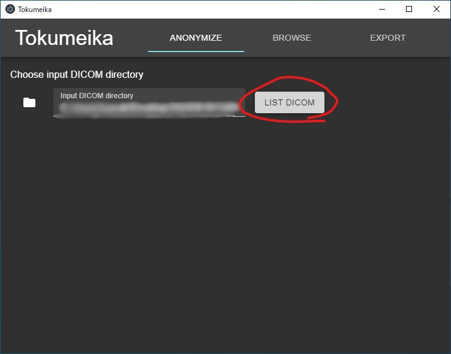
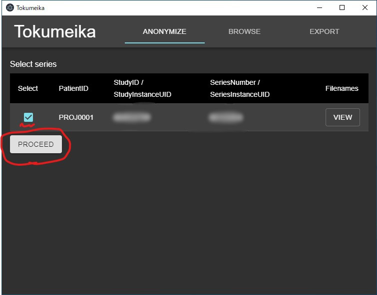
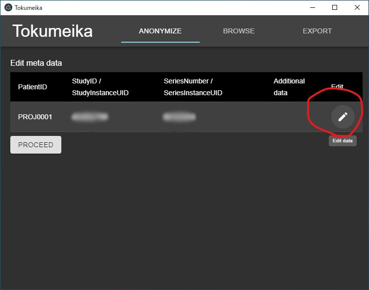
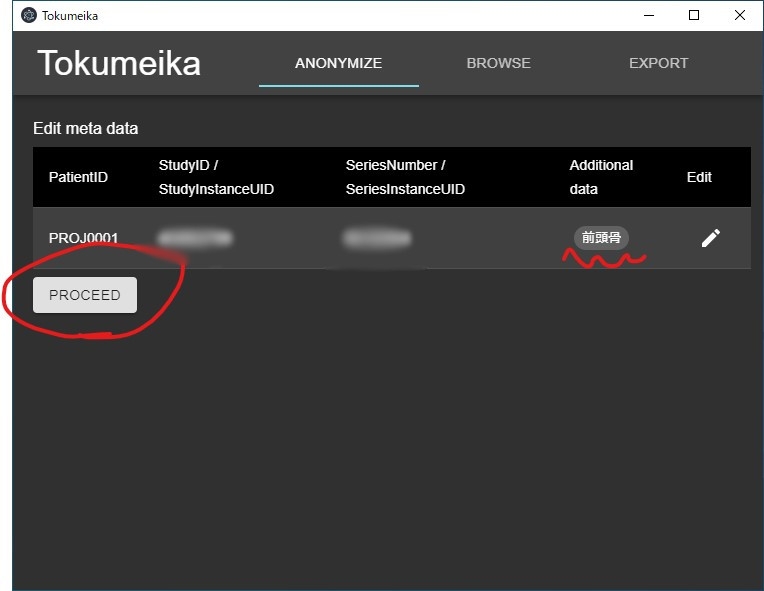
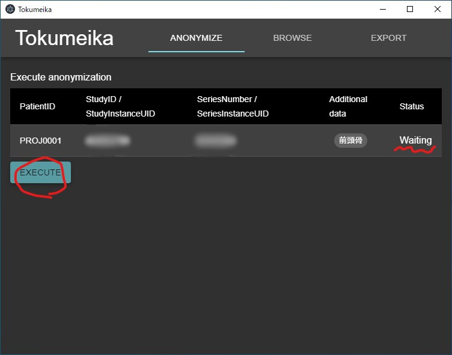

匿名化
======

起動
-----
``tokumeika-manager.exe`` をダブルクリックしてアプリを起動する。

.. figure:: images/app_folder.jpg

フォルダの指定
--------------
アプリを起動すると匿名化処理用の画面が開くので、匿名化する **シリーズ** が入っているフォルダを選択する。

.. figure:: images/list_dicom1.jpg

   フォルダのアイコンをクリックしてフォルダ選択のダイアログを起動する。

.. figure:: images/list_dicom2.jpg

   フォルダ選択のダイアログを使って匿名化する **シリーズ** が入っているフォルダを選択。

   フォルダを選択したら :guilabel:`LIST DICOM` ボタンをクリックする。環境によってはボタンをクリックした後に少し待つ必要がある。

匿名化するデータの確認
-----------------------
選択したフォルダに入っているDICOM画像の情報が表で表示される。
フォルダを上手く選択できていれば、1行だけの表が表示されるのでそのまま :guilabel:`PROCEED` をクリックして次に進む。
複数行表示されている場合は、匿名化処理をするシリーズだけにチェックをつけて  :guilabel:`PROCEED` をクリックして次に進む。

   通常、1行だけの表が表示される。

追加情報の付加
--------------
骨折箇所等の追加情報を付加する。

   アイコンをクリックしてダイアログを起動する。

.. figure:: images/add_meta2.jpg

   該当するアイコンをクリックして追加情報を付加する。

   表に追加されているデータが正しいことを確認して :guilabel:`PROCEED`

匿名化処理の実行
----------------
:guilabel:`EXECUTE` ボタンをクリックして匿名化処理を実行する。

   :guilabel:`EXECUTE` ボタンをクリック

.. figure:: images/exec2.jpg

   StatusがDoneになれば完了

結果の確認・修正
------------------
画面右上の :guilabel:`BROWSE` をクリックすると、今まで匿名化したデータを確認できる。必要があれば追加情報の修正を行う。

.. figure:: images/browse.jpg

   追加情報が間違っている場合はこの画面で変更できる。