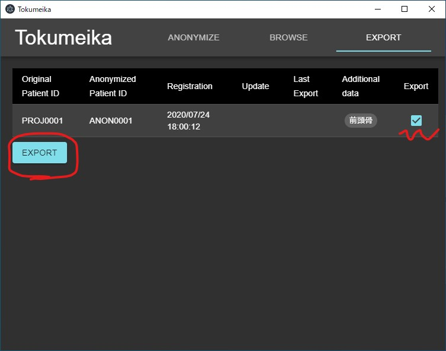

エクスポート
============

匿名化したデータをエクスポートする。

実行
------------
画面右上の :guilabel:`EXPORT` をクリックしてエクスポート用の画面に切り替える。
エクスポートしたいデータにチェックを入れて :guilabel:`EXPORT` ボタンをクリックする。

   エクスポートが必要なデータだけをチェックする。エクスポートが必要と思われるデータには最初からチェックがついているはず。

.. figure:: images/export2.jpg

   選択したデータのチェックが外れて、Last exportの欄が更新されれば完了。