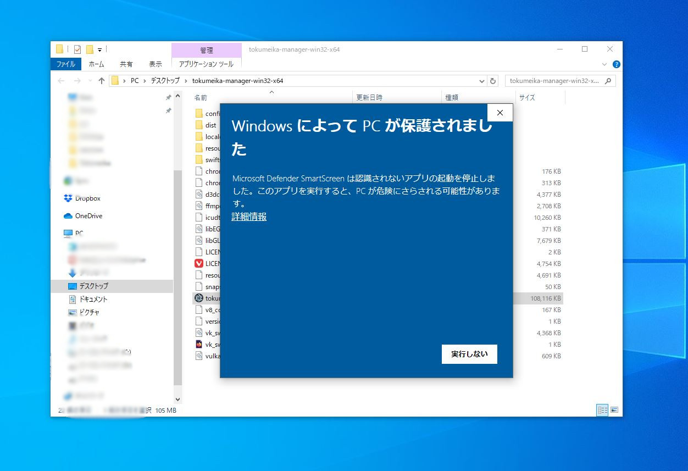
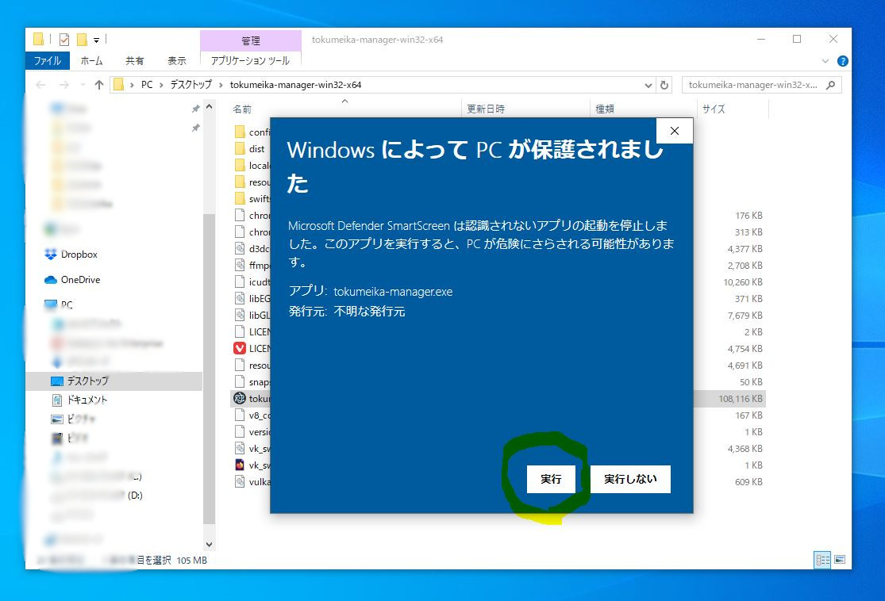

セットアップ
============

ダウンロード
------------

`配布サイト <https://github.com/yk-szk/Tokumeika/releases>`_ から最新版の ``tokumeika-manager-win32-x64.zip`` をダウンロードする

.. figure:: images/download.jpg

   最新版をダウンロードする。

展開
-----
ダウンロードしたzipファイルを展開。

初期設定
--------
アプリと同じフォルダ内の ``config/config.toml`` を編集して初期設定を行う。
`prefix = 'ANON'` を`prefix = 'OUH'` 等に変更する。

初回起動
--------
初回起動時に画像のような画面が表示された場合は、:guilabel:`詳細情報→実行` をクリックしてアプリを許可する。

   初回起動時にアプリがブロックされる場合がある。

   :guilabel:`詳細情報→実行` をクリックしてアプリを許可する。
