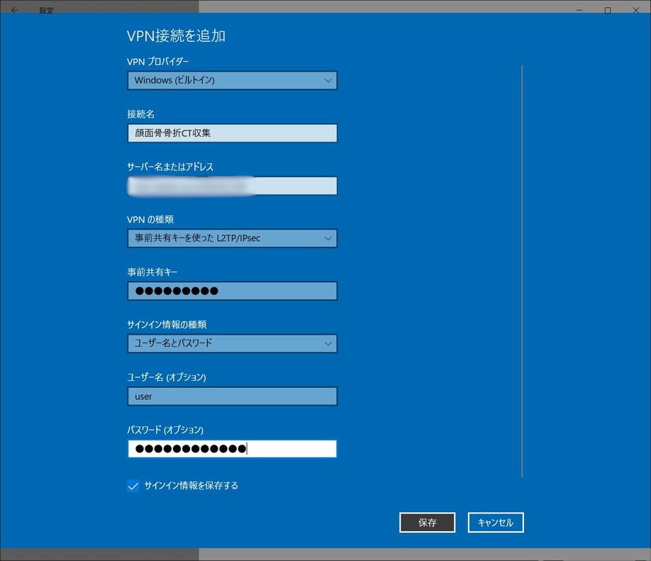
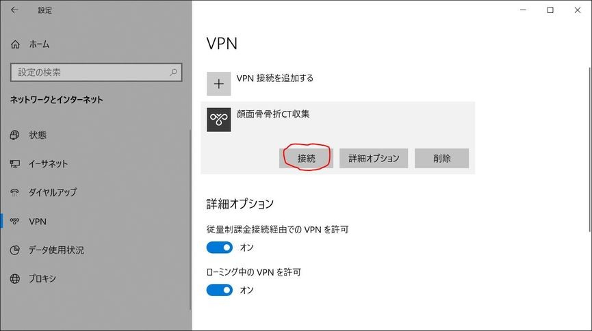
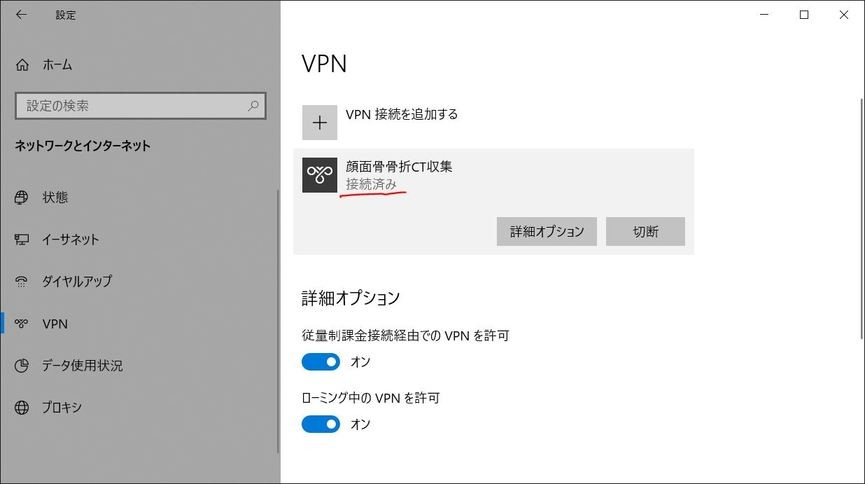

VPN接続
========

初期設定
-----------

ネットワークとインターネットを開く

.. figure:: images/vpn1.jpg

VPN設定画面を開く

.. figure:: images/vpn2.jpg

VPN接続を追加する    

.. figure:: images/vpn3.jpg

VPN接続の設定を行う

- 接続名 : 顔面骨骨折CT収集
- サーバー名またはアドレス : 別紙参照
- 事前共有キー : 別紙参照
- ユーザー名：別紙参照
- パスワード：別紙参照

VPN接続を行う

接続済みになれば成功

終了時には切断する

.. figure:: images/vpn7.jpg

ファイルサーバーへのアクセス
------------------------------

VPN接続を行う。(＊上記VPN接続を参照)

ファイルエクスプローラを開く。
アドレスバーに :file:`\\\\\\storage.cfdb.local` と入力しエンター。

.. figure:: images/upload1.png

パスワード入力を促されるので、その他をクリック

.. figure:: images/upload2.png

ユーザー名とパスワードを入力

- ユーザー名 : `cfdb\\別紙参照`
- パスワード : 別紙参照

.. figure:: images/upload3.png

Public, Share等のフォルダが表示されれば成功

.. figure:: images/upload4.png

ファイルのアップロード
--------------------------

匿名化プログラムのexportフォルダの中身を :file:`\\\\\\storage.cfdb.local\\ユーザー名` に移動する。